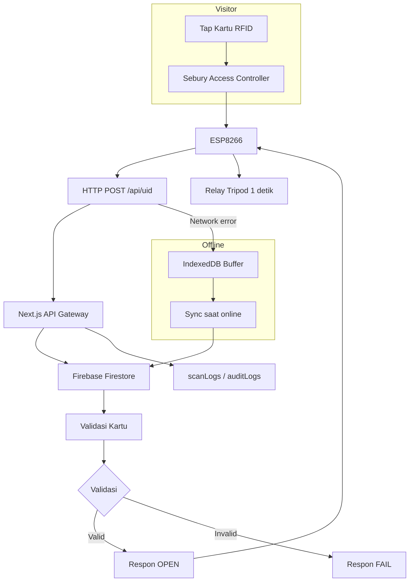

# Arsitektur Sistem Ticketing RFID Kolam Renang

## Komponen Utama

- Perangkat RFID Sebury + Access Controller
- ESP8266 dengan modul WiFi
- Aplikasi web Next.js (PWA)
- Firebase Firestore
- Firebase Authentication
- IndexedDB untuk offline queue
- Service worker untuk caching dan PWA

## Alur Data

1. Pengunjung tap kartu RFID pada pembaca Sebury.
2. Sebury Access Controller membaca UID kemudian meneruskan ke ESP8266 via serial/Wiegand.
3. ESP8266 mengirim UID dan `gateId` ke endpoint aplikasi web (`/api/uid`) melalui HTTP POST.
4. Aplikasi web memvalidasi UID terhadap Firestore.
5. Jika valid:
   - Simpan log di `scanLogs`
   - Update status kartu di `rfidCards`
   - Kirim respon `OPEN` ke ESP8266
6. ESP8266 mengaktifkan relay selama 1 detik untuk membuka tripod gate.
7. ESP8266 mengirim heartbeat berkala ke `/api/gate-heartbeat`; aplikasi menyimpan `lastSeen` di `gateDevices`.
8. Ketika offline: scan disimpan ke IndexedDB, kemudian otomatis sync saat kembali online.

## Diagram Aliran Sistem

## Communication Architecture

- ESP8266 <--> Web App: HTTP POST / WebSocket
- Web App <--> Firebase: SDK Firestore + Auth
- Browser <--> Offline Storage: Service Worker + IndexedDB
- Admin Dashboard <--> Firestore: Realtime snapshot

## Gateway & Realtime

- `pages/api/uid.ts` menerima UID
- `pages/api/gate-heartbeat.ts` menerima heartbeat ESP8266 dan memperbarui `gateDevices`
- Dashboard memantau koleksi `scanLogs` secara realtime dengan listener Firestore
- Status gate dibaca dari `gateDevices`; gate dianggap online jika `lastSeen` masih baru

## Web & Offline Flow

- Aplikasi dapat di-install sebagai PWA di laptop/PC
- Resource statis di-cache oleh `public/sw.js`
- Scan offline disimpan di IndexedDB dan disinkronisasi otomatis saat online
- Anti double-tap dan cooldown ditangani di sisi ESP8266 dan logika verifikasi
